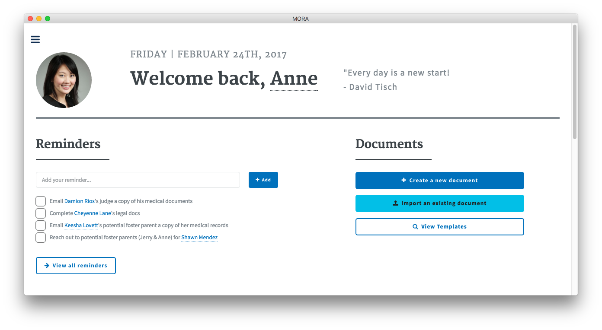

# venus-co

[](https://github.com/fvcproductions/venus-co/issues) [](https://github.com/fvcproductions/venus-co/pulls) [](http://badges.mit-license.org) [](http://paypal.me/fvcproductions)

Assets for Venus Co. | Startup Studio | Spring 2017 💕


## Installation

To run this app locally you'll need [Git](https://git-scm.com) and [Node.js](https://nodejs.org/en/download/) (which comes with [npm](http://npmjs.com)) installed on your computer.

From your command line, perform the following commands.

```bash
# Clone this repository
git clone https://github.com/fvcproductions/venus-co.git
# Go into the repository
cd venus-co
# Install dependencies & run the app
npm i && npm start
# Electron packager
npm i electron-packager --save-dev
npm i --save-dev electron
# Build Mac Packager
electron-packager . --overwrite --platform=darwin --arch=x64 --icon=assets/icons/mac/icon.icns --prune=true --out=release-builds
# Create DMG
cd app/release-builds/Mora-darwin-x64
create-dmg 'Mora.app'
```

> Having trouble opening the DMG (allow apps to be downloaded from anywhere)?

```bash
sudo sptcl --master-disable
```

- Learn more about Electron and its API in the [documentation](http://electron.atom.io/docs/).

## Usage

Project for Startup Studio 2017.

Photos taken from [AdoptUSKids](http://www.adoptuskids.org/).

## Screenshots

### Sprint 1


### Sprint 2



## Contributing

> To get started...

- 🍴 Fork this repo [here](https://github.com/fvcproductions/venus-co#fork-destination-box)
- 🔨 Hack away
- 👥 Add yourself as a contributor under credits
- 🔧 Make a pull request [here](https://github.com/fvcproductions/venus-co/compare)
- 🎉 Get your pull request approved - success!

Or just [create an issue](https://github.com/fvcproductions/venus-co/issues) - any little bit of help counts! 😊

## Credits

- [FVCproductions](http://fvcproductions.com) 🍓🍫